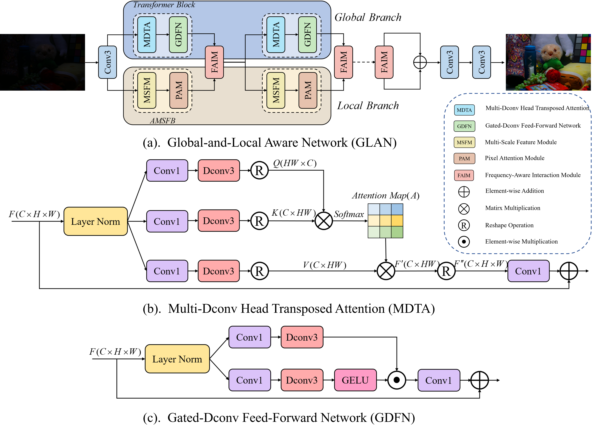
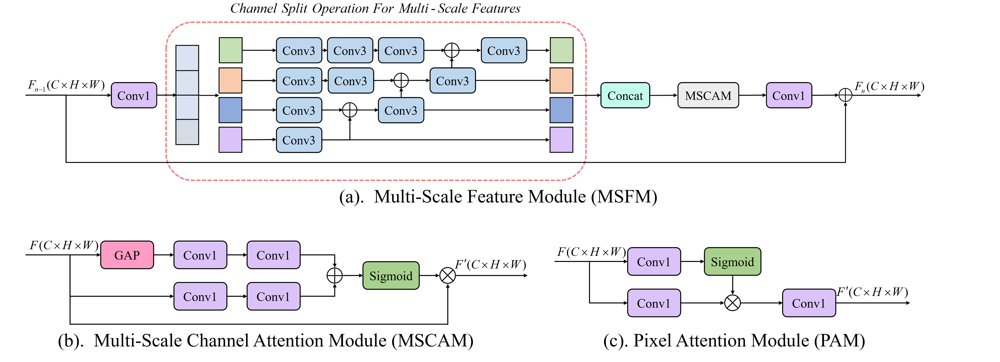
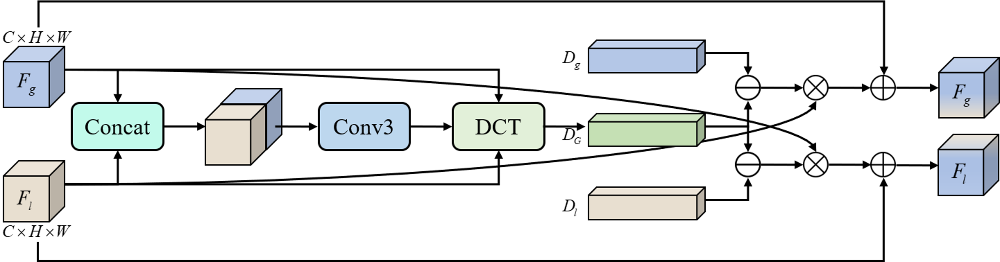
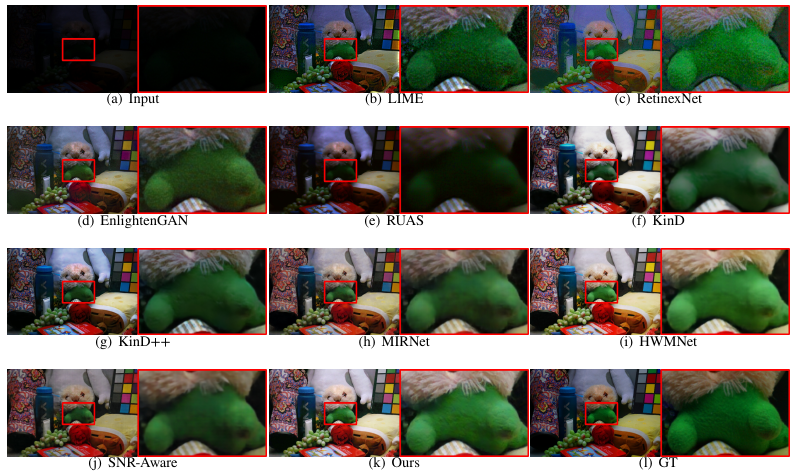
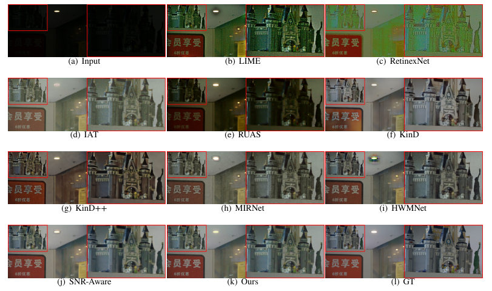
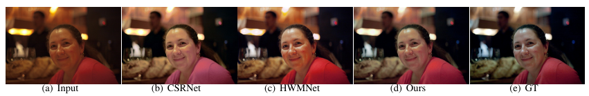

# [EAAI 2023] [Global-and-Local Aware Network for Low-Light Image Enhancement]
## Xufeng He, Zhihua Chen, Lei Dai, Lei Liang, Jianfa Wu, Bin Sheng


> Abstract : Photos taken under nighttime or backlit conditions often suffer from complex and unpredictable degradation,
 such as low visibility, messy noise, and distorted color. Previous methods mainly focused on global brightness
 and contrast while ignoring structural and textural details, or they handled the fusion of features without
 adequately considering their intrinsic association, resulting in incomplete feature representations. To address
 this issue, we propose a global-and-local aware network (GLAN) by projecting the features into the frequency
 domain and incorporating them in a knowledge-sharing manner. This method effectively integrates the global
 modeling capability of the transformer and the local sensitivity of the convolutional neural network to
 represent structure and texture. First, the global branch, which is comprised of transformer blocks, performs
 feature extraction under the global receptive field, while the local branch constructs multi-scale features
 to provide local fine-grained details. Then, we design a novel adaptive multi-scale feature block (AMSFB)
 that deploys channel split operation to decrease the calculation amount. To better learn the channel and
 spatial correlations of intermediate features, we introduce a multi-scale channel attention module (MSCAM)
 and a pixel attention module (PAM) into the AMSFB. Finally, a frequency-aware interaction module (FAIM)
 is developed for bidirectional information supplementation, which builds feature descriptors simultaneously
 covering low-frequency and high-frequency information based on the discrete cosine transform (DCT). Through
 extensive quantitative and qualitative experiments, our method can achieve competitive results compared with
 over ten state-of-the-art image enhancement methods on eight benchmark datasets.

## Network Architecture  
<table>
  <tr>
    <td colspan="2"> </td>  
  </tr>
  <tr>
    <td colspan="2"><p align="center"><b>Overall Framework of GLAN</b></p></td>
  </tr>

  <tr>
    <td>  </td>
    <td>  </td>
  </tr>
  <tr>
    <td><p align="center"><b>Adaptive Multi-scale Feature Block (AMSFB)</b></p></td>
    <td><p align="center"> <b>Frequency-aware Fnteraction Module (FAIM)</b></p></td>
  </tr>
</table>

## Quick Run   

To test the pre-trained models of enhancing on your own images, run
```
python demo.py --input_dir images_folder_path --result_dir save_images_here --weights path_to_models
```
**All pre-trained models can be downloaded at [LOL](https://pan.baidu.com/s/1fCzO2GkkDr0dd4WBufX5lg?pwd=vglb), [LOL-v2](链接：https://pan.baidu.com/s/1FMFSYG5YieF6azaTLWSCeg?pwd=092f), [MIT5K](https://pan.baidu.com/s/19zijHQIpGu8LuKVUHOAYOw?pwd=m1nx)**  

## Train  
To train the restoration models of low-light enhancement. You should check the following components are correct:  
- `training.yaml`:  
  ```
  # Training configuration
  GPU: [0]

  VERBOSE: False

  MODEL:
    MODE: ''

  # Optimization arguments.
  OPTIM:
    BATCH: 2
    EPOCHS: 300
    # EPOCH_DECAY: [10]
    LR_INITIAL: 2e-4
    LR_MIN: 1e-6
    # BETA1: 0.9

  TRAINING:
    VAL_AFTER_EVERY: 1
    RESUME: False
    TRAIN_PS: 256
    VAL_PS: 256
    TRAIN_DIR: './datasets/LOL/train'       # path to training data
    VAL_DIR: './datasets/LOL/test' # path to validation data
    SAVE_DIR: './checkpoints'           # path to save models and images
  ```
  
- Dataset:  
  All training dataset can be downloaded at [LOL](https://pan.baidu.com/s/11e0p-Ft_yES9eBJCenaAhg?pwd=y93f), [LOL-v2](https://pan.baidu.com/s/11uGyp0KcRxvWoYth1OULHA?pwd=z8hy), [MIT5K_random sampling](https://drive.google.com/drive/folders/1qrGLFzW7RBlBO1FqgrLPrq9p2_p11ZFs?usp=sharing), [MIT5K_nonrandom sampling](https://drive.google.com/drive/folders/18bTBJX34I3CjAb9qBDxvHWRPQLYSQcld?usp=share_link).  
  
- Train:  
  If the above path and data are all correctly setting, just simply run:  
  ```
  python train.py
  ```  

## Test (Evaluation)  
 
- To test the PSNR, SSIM and LPIPS of *image enhancement*, see [evaluation.py](./evaluation.py) and run
```
python evaluation.py -dirA images_folder_path -dirB images_folder_path -type image_data_type --use_gpu use_gpu_or_not
```

## Visual Comparison  
- Evaluation on LOL dataset  
  

- Evaluation on LOL-v2 dataset  
  

- Evaluation on MIT-Adobe FiveK dataset  
  


## Acknowledgement
The code is based on [HWMNet](https://github.com/FanChiMao/HWMNet.git),[FcaNet](https://github.com/cfzd/FcaNet.git),[Restormer](https://github.com/swz30/Restormer.git). 
